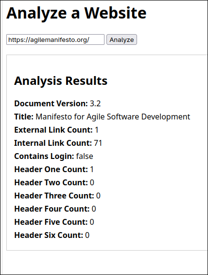

# Home24 Assignment

Author: Guillermo Pedro Fuchter

## Introduction

This repository contains my solution for the Home24 assignment, which focuses on developing a web application to extract and display various statistics from a given website's HTML content. You can find the original assignment details in the `docs/` directory.



My solution is comprised of a static website frontend connected to a RESTful API backend. The static website can be accessed through `localhost:8080/` after running the application. The primary API endpoint available is:

- **POST** `localhost:8080/reports/webpage`
    - **Request Body:** Accepts JSON as a request body.
    - **Response Body:** Returns a JSON response body containing the webpage statistics.

**Request Body Example:**
```json
{
    "url": "https://agilemanifesto.org/" 
}
```

**Response Body Example:**
```json
{
   "documentVersion":"3.2",
   "title":"Manifesto for Agile Software Development\n",
   "externalLinkCount":1,
   "internalLinkCount":71,
   "containsLogin":false,
   "headerOneCount":1,
   "headerTwoCount":0,
   "headerThreeCount":0,
   "headerFourCount":0,
   "headerFiveCount":0,
   "headerSixCount":0
}
```

**Example API Call:**
```bash
curl -X POST \
  http://localhost:8080/reports/webpage \
  -H 'Content-Type: application/json' \
  -d '{
    "url": "https://agilemanifesto.org/"
  }'
```

## Assumptions

When building the solution, the following assumption were made:
- **Internal Links:** Internal links are the links with relative paths (ie: `/home`) and links with the same hostname as the website.
- **External Links:** External links are links with a different hostname (this includes links with different subdomains)

## Design Decisions

Several architectural and technical design decisions were made to ensure the solution is robust, scalable, and maintainable:

- **RESTful API Design:** Designed it as a RESTful API to decouple the frontend from backend and to make the backend re-usable by other API consumers.
- **Domain-Driven Design (DDD) and Hexagonal Architecture:** While potentially overkill, the application was designed with DDD and hexagonal architecture in mind. These are industry standard architectural patterns and philosophies that promotes clean separation of concerns and maintainability.
- **Dependency Injection:** Followed Dependency injection to have a decoupled codebase
- **Containerization:** This application is containerized using Docker. This decision was made to facilitate development across different environment, and to enable easier deployment to the cloud.
- **Echo HTTP Server Framework:** Used [echo](https://echo.labstack.com/) as the HTTP server framework for its performance and features.
- **HTML Query Library:** Used [htmlquery](https://github.com/antchfx/htmlquery) to facilitate the parsing and downloading of HTML documents


## Running The Application

To get the application up and running, please ensure you have the following requisites installed:

### Requisites:
- [Task](https://taskfile.dev/): A Task runner similar to make.
- [Docker](https://www.docker.com/) or [go 1.24](https://go.dev/).
- Internet connection: Required for downloading dependencies and accessing external URLs.

### Tasks

Execute any of the task using the `task` CLI tool from the project root:

```
task server:build # Builds the application to the /build directory
task server:run   # Runs the application in your environment
task docker:build # Builds docker image
task docker:run   # Creates and runs the docker container
task test:unit    # Executes unit tests
```

## Project Structure

The project adheres to the [unofficial golang project layout](https://github.com/golang-standards/project-layout). It also incorporates principles from [Domain Driven Design](https://en.wikipedia.org/wiki/Domain-driven_design) and [Hexagonal Architecture](https://en.wikipedia.org/wiki/Hexagonal_architecture_(software)).

```
.
├── cmd/
│   └── main.go           # Application entry point for the server. Injects dependencies
├── internal/
│   ├── domain/
│   │   ├── model/        # Core domain entities
│   │   ├── service.go    # Domain services, encapsulate business logic
│   ├── adapters/
│   │   └── http/
│   │       └── handler/  # HTTP handlers
│   ├── ports/            # Interfaces defining the boundaries (ports)
│   └── application/      # Application layer (coordinates domain services)
├── buld/                 # Build files
├── static/               # Static files for the frontend
├── docs/                 # Documentation
├── containers/           # Container files (Dockerfile)
├── Taskfile.yml
└── README.md
```

### 3rd Party Packages Used

- [echo](https://echo.labstack.com/) - as the HTTP server framework
- [htmlquery](https://github.com/antchfx/htmlquery) - XPath query package for HTML

## Possible Improvements

This solution provides a solid foundation, but there are several areas where it could be further enhanced:

- **Increase code coverage**
- **Improve error handling:** Currently the API returns 500 if anything goes wrong, which provides no useful information to the APIs consumer.
- **Add OpenAPI schema + OpenAPI static page**
    - This would provide a clear documentation, making it easier for consumer to understand the API.
- **Validation:** Add validation for HTTP request and response bodies
    - Either with playground validator or with an OpenAPI validator
- **Configuration:** Move configuration to environment variables
    - This will make it easier to deploy to a Cloud
- **Smoke Tests:** Add smoke test with tools like k6.io
- **Healthcheck:** Add healthcheck endpoint
- **Go Routines:** Look into improving performance by parallelizing it with go routines
- **Code Coverage Report:** Add code coverage report
- **CD/CI pipelines:** For running test automatically and generating code coverage